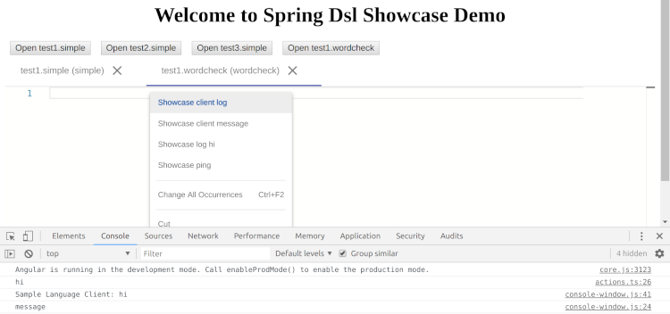

[[dsl-examples-showcase]]
== Showcase
_Showcase_ is a sample module not adding any new language
definitions, but instead using languages from <<dsl-examples-simple>>,
<<dsl-examples-wordcheck>> and <<dsl-examples-dot>> and
adding some other additional features for interactions between
a client and a server.

We define a new `Hoverer` which simply gives a hardcoded hover. For
this sample this is mostly done because wordcheck sample doesn't have
`Hoverer` of its own.

[source,java,indent=0]
----
include::samples/demo/showcase/ShowcaseHoverer.java[tags=snippet1]
----

We want to demostrate some communication concepts from a client, so
we define a new controller.

[source,java,indent=0]
----
include::samples/demo/showcase/ShowcaseCommandsController.java[tags=snippet1]
----

This first method `showcase/ping` just logs something to a server log.

[source,java,indent=0]
----
include::samples/demo/showcase/ShowcaseCommandsController.java[tags=snippet2]
----

This method `showcase/log` sends a `window/logMessage` notification back to
a client.

[source,java,indent=0]
----
include::samples/demo/showcase/ShowcaseCommandsController.java[tags=snippet3]
----

This method `showcase/message` sends a `window/showMessageRequest` request
back to a client and logs a response client sends.

[source,java,indent=0]
----
include::samples/demo/showcase/ShowcaseCommandsController.java[tags=snippet4]
----

We creata a simple `@Configuration` to have all _showcase_ features configured
in one place.

[source,java,indent=0]
----
include::samples/demo/showcase/ShowcaseConfiguration.java[tags=snippet1]
----

As usual we also define `EnableShowcaseFeatures` annotation which can be
used to enable all _showcase_ features.

[source,java,indent=0]
----
include::samples/demo/showcase/EnableShowcaseFeatures.java[tags=snippet1]
----

=== UI Editor
_UI Editor_ is and example using websockets for a transport.

We create a normal main class and enable all features and languages using
annotations `EnableWordcheckLanguage`, `EnableSimpleLanguage`,
`EnableDOTLanguage` and `EnableShowcaseFeatures`.

[source,java,indent=0]
----
include::samples/demo/showcaseeditor/Application.java[tags=snippet1]
----

When running this application you are presented editors for both language
types _simple_ and _wordcheck_. Context menu also have a custom
actions associated.

